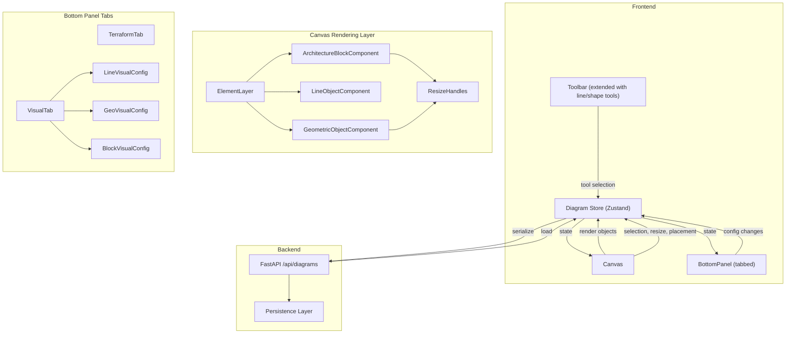

# Design Document: Canvas Objects Editor

## Overview

This design extends the IaCreator diagram editor to support multiple canvas object types beyond the existing AWS service nodes. The system introduces a unified `CanvasObject` type hierarchy with three categories: Architecture Blocks (existing service nodes, extended), Line Objects (straight lines/arrows), and Geometric Objects (rectangles, ellipses). Each object is selectable, resizable, and configurable through a redesigned tabbed bottom panel.

The key architectural changes are:
1. A new type system (`CanvasObject`) that generalizes the existing `DiagramElement` to support multiple object categories
2. New canvas rendering components for lines and geometric shapes
3. Resize handles on selected objects
4. A tabbed `BottomPanel` replacing the current `ConfigPanel`, with a Terraform tab (architecture blocks only) and a Visual tab (all objects)
5. Visual configuration (color, stroke, fill, dimensions) per object type
6. Extended serialization to persist visual config through save/load

The frontend remains Next.js/TypeScript with Zustand. The backend (Python FastAPI) requires minimal changes since `SerializedElementInput` already uses `extra="allow"`, so new fields pass through without backend model changes.

## Architecture



### Design Decisions

1. **Unified CanvasObject type with discriminated union**: Rather than separate Maps for each object type, we use a single `canvasObjects` Map with a discriminated union (`objectType` field). This simplifies selection, iteration, and serialization while keeping type safety via TypeScript narrowing.

2. **Extend existing store rather than new store**: The `useDiagramStore` already manages elements, connectors, viewport, and serialization. We extend it with `canvasObjects` (replacing `elements` for new object types) while keeping backward compatibility. Existing `elements` Map continues to hold architecture blocks for Terraform export compatibility.

3. **SVG overlay for lines, DOM for blocks/shapes**: Lines with arrows are best rendered as SVG. Architecture blocks and geometric shapes remain DOM elements for consistency with the existing approach. The `ElementLayer` dispatches to the correct renderer based on object type.

4. **Backend passthrough**: The backend's `SerializedElementInput` uses `extra="allow"`, so new fields (width, height, visual config) serialize through without backend changes. The `diagram_state` is stored as an opaque `dict`.

5. **Minimum dimension enforcement at store level**: The 40px minimum for width/height is enforced in the store's update functions, not just in the UI. This ensures the invariant holds regardless of how updates originate.

## Components and Interfaces

### Type System (`frontend/src/types/diagram.ts` — extended)

```typescript
// Object categories
export type CanvasObjectType = 'architecture-block' | 'line' | 'geometric';

// Geometric shape variants
export type GeometricShape = 'rectangle' | 'ellipse';

// Stroke style
export type StrokeStyle = 'solid' | 'dashed';

// Visual config per object type
export interface ArchitectureBlockVisualConfig {
  width: number;   // min 40
  height: number;  // min 40
}

export interface LineVisualConfig {
  color: string;
  borderWidth: number;
  strokeStyle: StrokeStyle;
  startArrow: boolean;
  endArrow: boolean;
}

export interface GeometricVisualConfig {
  width: number;    // min 40
  height: number;   // min 40
  fill: boolean;
  fillColor: string;
  borderColor: string;
  borderWidth: number;
  shape: GeometricShape;
}

// Unified canvas object (discriminated union)
export type CanvasObject =
  | ArchitectureBlock
  | LineObject
  | GeometricObject;

export interface ArchitectureBlock {
  id: string;
  objectType: 'architecture-block';
  serviceType: ServiceType;
  name: string;
  position: Point;
  config: ResourceConfig;
  visualConfig: ArchitectureBlockVisualConfig;
}

export interface LineObject {
  id: string;
  objectType: 'line';
  name: string;
  start: Point;
  end: Point;
  visualConfig: LineVisualConfig;
}

export interface GeometricObject {
  id: string;
  objectType: 'geometric';
  name: string;
  position: Point;
  visualConfig: GeometricVisualConfig;
}
```

### Tool Extensions (`frontend/src/types/diagram.ts`)

```typescript
export type Tool =
  | 'pointer'
  | 'connector'
  | 'line'                                          // new
  | { type: 'place-service'; serviceType: ServiceType }
  | { type: 'place-shape'; shape: GeometricShape }; // new
```

### Store Extensions (`frontend/src/store/diagram-store.ts`)

New state and actions added to `DiagramStore`:

```typescript
// Canvas objects (unified map)
canvasObjects: Map<string, CanvasObject>;
addCanvasObject: (obj: Omit<CanvasObject, 'id'>) => string;
updateCanvasObject: (id: string, updates: Partial<CanvasObject>) => void;
removeCanvasObject: (id: string) => void;

// Visual config updates (type-safe per object type)
updateVisualConfig: (id: string, config: Partial<ArchitectureBlockVisualConfig | LineVisualConfig | GeometricVisualConfig>) => void;

// Resize
updateObjectBounds: (id: string, bounds: { width?: number; height?: number }) => void;
updateLineEndpoint: (id: string, endpoint: 'start' | 'end', position: Point) => void;

// Selection (replaces selectedElementId for canvas objects)
selectedObjectId: string | null;
selectObject: (id: string | null) => void;
```

### Canvas Components

| Component | File | Responsibility |
|-----------|------|----------------|
| `ElementLayer.tsx` (modified) | `canvas/ElementLayer.tsx` | Iterates `canvasObjects`, dispatches to type-specific renderers |
| `ArchitectureBlockComponent.tsx` | `canvas/ArchitectureBlockComponent.tsx` | Renders architecture block with icon, label, respects `visualConfig.width/height` |
| `LineObjectComponent.tsx` | `canvas/LineObjectComponent.tsx` | SVG line/arrow rendering with visual config |
| `GeometricObjectComponent.tsx` | `canvas/GeometricObjectComponent.tsx` | Renders rectangle/ellipse with fill, border, dimensions |
| `ResizeHandles.tsx` | `canvas/ResizeHandles.tsx` | 8 resize handles (4 corners + 4 midpoints) for selected block/shape objects |

### Bottom Panel Components

| Component | File | Responsibility |
|-----------|------|----------------|
| `BottomPanel.tsx` | `config/BottomPanel.tsx` | Replaces `ConfigPanel`. Tabbed container with Terraform + Visual tabs |
| `TerraformTab.tsx` | `config/TerraformTab.tsx` | Wraps existing `ServiceConfigForm` dispatch logic |
| `VisualTab.tsx` | `config/VisualTab.tsx` | Dispatches to type-specific visual config forms |
| `BlockVisualConfig.tsx` | `config/BlockVisualConfig.tsx` | Width/height fields for architecture blocks |
| `LineVisualConfig.tsx` | `config/LineVisualConfig.tsx` | Color, border width, stroke style, arrow toggles |
| `GeoVisualConfig.tsx` | `config/GeoVisualConfig.tsx` | Width, height, fill toggle, fill color, border color, border width, shape type |

### Toolbar Extensions

The `Toolbar.tsx` gains two new tool buttons:
- **Line tool**: Activates `'line'` tool mode. User clicks two points to create a line.
- **Shape tool**: Dropdown or button group for rectangle/ellipse. Activates `{ type: 'place-shape', shape }` tool mode.


## Data Models

### Frontend Data Models

#### CanvasObject (Discriminated Union)

The core data model. All objects share `id`, `objectType`, and `name`. The `objectType` field acts as the discriminant.

| Field | Type | Present On | Description |
|-------|------|-----------|-------------|
| `id` | `string` | All | UUID, unique identifier |
| `objectType` | `CanvasObjectType` | All | Discriminant: `'architecture-block'`, `'line'`, `'geometric'` |
| `name` | `string` | All | Display name / label |
| `position` | `Point` | Block, Geometric | Top-left position in canvas coordinates |
| `start` | `Point` | Line | Start endpoint in canvas coordinates |
| `end` | `Point` | Line | End endpoint in canvas coordinates |
| `serviceType` | `ServiceType` | Block | AWS service type |
| `config` | `ResourceConfig` | Block | Terraform resource configuration |
| `visualConfig` | varies | All | Type-specific visual configuration |

#### Default Visual Configs

When a new object is created, it receives default visual config values:

```typescript
const DEFAULT_BLOCK_VISUAL: ArchitectureBlockVisualConfig = {
  width: 80,
  height: 80,
};

const DEFAULT_LINE_VISUAL: LineVisualConfig = {
  color: '#ffffff',
  borderWidth: 2,
  strokeStyle: 'solid',
  startArrow: false,
  endArrow: false,
};

const DEFAULT_GEO_VISUAL: GeometricVisualConfig = {
  width: 120,
  height: 80,
  fill: false,
  fillColor: '#3b82f6',
  borderColor: '#ffffff',
  borderWidth: 2,
  shape: 'rectangle',
};
```

#### Minimum Dimension Constants

```typescript
const MIN_OBJECT_WIDTH = 40;
const MIN_OBJECT_HEIGHT = 40;
```

### Serialization Model Extensions

The `SerializedElement` type is extended to carry canvas object data:

```typescript
export interface SerializedCanvasObject {
  id: string;
  objectType: CanvasObjectType;
  name: string;
  // Position fields (block/geometric)
  x?: number;
  y?: number;
  // Line endpoints
  startX?: number;
  startY?: number;
  endX?: number;
  endY?: number;
  // Architecture block fields
  serviceType?: ServiceType;
  config?: ResourceConfig;
  // Visual config (flattened or nested)
  visualConfig: Record<string, unknown>;
}
```

The `DiagramState` interface gains a new field:

```typescript
export interface DiagramState {
  version: number;  // bumped to 2
  projectName: string;
  environments: EnvironmentConfig[];
  elements: SerializedElement[];       // kept for backward compat
  canvasObjects: SerializedCanvasObject[]; // new
  connectors: SerializedConnector[];
  viewport: Viewport;
}
```

### Backend Data Models

No backend model changes required. The existing `SerializedElementInput` with `extra="allow"` and `diagram_state: dict` in `DiagramRecord` already support arbitrary fields. The new `canvasObjects` array is stored as part of the opaque `diagram_state` dict.

### State Invariants

1. Every `CanvasObject` has a unique `id` (UUID)
2. Architecture blocks with `objectType: 'architecture-block'` always have a valid `serviceType`
3. All width/height values are ≥ `MIN_OBJECT_WIDTH` (40) / `MIN_OBJECT_HEIGHT` (40)
4. Only one object can be selected at a time (`selectedObjectId` is singular)
5. Deleting an architecture block removes all connectors referencing it
6. Visual config is always present with valid defaults — never `undefined`


## Correctness Properties

*A property is a characteristic or behavior that should hold true across all valid executions of a system — essentially, a formal statement about what the system should do. Properties serve as the bridge between human-readable specifications and machine-verifiable correctness guarantees.*

### Property 1: Object creation assigns unique ID and correct category

*For any* canvas object type (architecture-block, line, or geometric) and any valid creation parameters, adding the object to the store should produce an object with a unique UUID and the correct `objectType` field matching the requested category.

**Validates: Requirements 1.1, 1.2**

### Property 2: Object placement stores correct position

*For any* canvas object type and any valid canvas coordinate, creating the object at that coordinate should result in the store containing an object whose position (or start/end for lines) matches the provided coordinate.

**Validates: Requirements 2.1, 2.2, 2.3**

### Property 3: New objects receive default visual config

*For any* canvas object type, when a new object is created without explicit visual config, the resulting object's `visualConfig` should equal the default visual config for that object type (e.g., `DEFAULT_BLOCK_VISUAL` for architecture blocks, `DEFAULT_LINE_VISUAL` for lines, `DEFAULT_GEO_VISUAL` for geometric objects).

**Validates: Requirements 2.4**

### Property 4: Single selection invariant

*For any* sequence of `selectObject` calls, the store's `selectedObjectId` should always contain at most one value. Selecting object B after object A should result in only B being selected, and A should no longer be selected.

**Validates: Requirements 3.4**

### Property 5: Minimum dimension enforcement

*For any* canvas object with width/height (architecture blocks and geometric objects) and any attempted resize to dimensions (w, h), the resulting stored dimensions should be `max(w, 40)` for width and `max(h, 40)` for height. No object should ever have dimensions below 40×40.

**Validates: Requirements 4.4, 7.3, 9.6**

### Property 6: Visual config updates persist in store

*For any* canvas object and any valid partial visual config update, after calling `updateVisualConfig`, the store should contain the object with the updated visual config fields merged into the existing config, while non-updated fields remain unchanged.

**Validates: Requirements 4.2, 4.3, 4.5, 6.2, 7.2, 8.2, 8.3, 9.5**

### Property 7: Tab configuration matches object type

*For any* canvas object, the set of available tabs should be: two tabs (Terraform + Visual) if the object is an architecture block, or one tab (Visual only) if the object is a line or geometric object.

**Validates: Requirements 5.1, 5.2**

### Property 8: Visual config serialization round trip

*For any* valid set of canvas objects with visual configs, serializing the diagram state and then deserializing it should produce canvas objects with equivalent visual configs. That is, `deserialize(serialize(objects))` should be deeply equal to the original objects.

**Validates: Requirements 10.1, 10.2, 10.3**

### Property 9: Object deletion removes from store

*For any* canvas object present in the store, calling `removeCanvasObject` with its ID should result in the store no longer containing that object.

**Validates: Requirements 11.1, 11.2**

### Property 10: Architecture block deletion cascades to connectors

*For any* architecture block that has connectors (where the block's ID appears as `sourceId` or `targetId`), deleting the block should also remove all connectors that reference it. No orphaned connectors should remain.

**Validates: Requirements 11.3**

### Property 11: Deletion clears selection

*For any* selected canvas object, after deleting that object, the store's `selectedObjectId` should be `null`.

**Validates: Requirements 11.4**

## Error Handling

### Frontend Error Handling

| Scenario | Handling |
|----------|----------|
| Invalid dimension input (non-numeric, negative) | Clamp to minimum 40px, ignore non-numeric input |
| Invalid color value | Fall back to default color for the object type |
| Missing visual config on load (old diagram format) | Apply default visual config for the object type |
| Object ID not found in store | No-op for update/delete operations, log warning |
| Serialization of unknown object type | Skip the object, log warning, continue with remaining objects |
| Deserialization of unknown object type | Skip the object, log warning, load remaining objects |
| Version mismatch on diagram load | Migrate v1 diagrams by converting `elements` to `canvasObjects` with default visual configs |

### Backend Error Handling

The backend requires no new error handling. The `extra="allow"` config on `SerializedElementInput` and the opaque `diagram_state: dict` storage mean new fields pass through transparently. Existing validation (422 for malformed payloads, 403/404 for ownership/missing) continues to apply.

## Testing Strategy

### Dual Testing Approach

This feature uses both unit tests and property-based tests for comprehensive coverage:

- **Unit tests**: Verify specific examples, edge cases, integration points, and UI rendering behavior
- **Property-based tests**: Verify universal properties across randomly generated inputs

### Property-Based Testing Configuration

- **Library**: `fast-check` (TypeScript) for frontend store logic
- **Minimum iterations**: 100 per property test
- **Tag format**: `Feature: canvas-objects-editor, Property {number}: {property_text}`
- Each correctness property above maps to exactly one property-based test

### Unit Test Coverage

| Area | Tests |
|------|-------|
| Object creation | Specific examples for each object type with known inputs |
| Resize handles | Edge case: resize to exactly 40px, resize to 0px (should clamp) |
| Tab rendering | Example: architecture block shows 2 tabs, line shows 1 tab |
| Visual config forms | Example: line config form renders all 5 controls |
| Deletion cascade | Example: delete block with 2 connectors, verify both removed |
| Serialization migration | Example: load v1 diagram, verify objects get default visual configs |
| Toolbar tool switching | Example: select line tool, verify tool state changes |

### Property-Based Test Coverage

| Test | Property | Description |
|------|----------|-------------|
| PBT 1 | Property 1 | Generate random object types and params, verify ID uniqueness and category |
| PBT 2 | Property 2 | Generate random positions and object types, verify stored position |
| PBT 3 | Property 3 | Generate random object types, verify default visual config |
| PBT 4 | Property 4 | Generate random sequences of select/deselect, verify single selection |
| PBT 5 | Property 5 | Generate random dimensions (including below 40), verify clamping |
| PBT 6 | Property 6 | Generate random objects and partial config updates, verify merge |
| PBT 7 | Property 7 | Generate random object types, verify tab count |
| PBT 8 | Property 8 | Generate random canvas objects with visual configs, verify round trip |
| PBT 9 | Property 9 | Generate random objects, add then remove, verify absence |
| PBT 10 | Property 10 | Generate blocks with random connectors, delete block, verify no orphans |
| PBT 11 | Property 11 | Generate random objects, select one, delete it, verify null selection |

### Backend Testing

No new backend tests are needed. The existing diagram CRUD tests cover the passthrough behavior since `extra="allow"` is already tested. The `diagram_state` is stored as an opaque dict and returned as-is.
