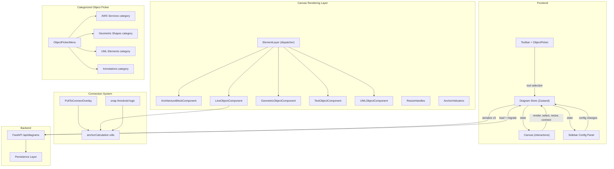

# Design Document: Canvas Objects Editor (v2)

## Overview

This design extends the existing canvas objects system to support a significantly richer set of diagram primitives. The current system supports three object types (architecture blocks, lines, geometric shapes with rectangle/ellipse). This v2 design adds:

1. **Icon-first architecture block rendering** — the AWS icon becomes the primary visual, scaling with block dimensions; service name label appears only when explicitly set
2. **Unified line/arrow with connection anchors** — lines gain optional `sourceAnchor` and `targetAnchor` fields that reference other canvas objects, with automatic endpoint recomputation when connected objects move
3. **Pull-to-connect interaction** — hovering near object edges reveals anchor indicators; dragging from them creates a new anchored line
4. **Text objects** — double-click canvas to create inline-editable text labels with configurable font size, color, and alignment
5. **Expanded geometric shapes (25+)** — the `GeometricShape` union grows from 2 to 26+ variants, each rendered via an SVG path function
6. **UML objects** — class, interface, actor, use case, component, package, and node with compartment-based rendering
7. **Categorized object picker** — replaces the current AWS-only service picker with a unified picker organized into AWS Services, Geometric Shapes, UML Elements, and Annotations categories
8. **Connection state persistence** — anchor references serialize/deserialize through save/load
9. **Serialization v3** — all new types round-trip through JSON with v2→v3 migration

The architecture remains Next.js/TypeScript with Zustand state management. The backend continues to use `extra="allow"` on Pydantic models, so new fields pass through without backend changes. All changes are frontend-only.

## Architecture



### Key Design Decisions

1. **Extend the existing discriminated union** — `CanvasObject` gains two new variants (`text` and `uml`) alongside the existing three. The `objectType` discriminant field continues to drive type narrowing, rendering dispatch, and serialization. This keeps the single `canvasObjects` Map approach.

2. **Connection anchors on LineObject, not a separate Connection type** — Rather than introducing a separate `Connection` entity, we add optional `sourceAnchor` and `targetAnchor` to `LineObject`. This keeps the type system simpler and means every visual line on canvas is the same type whether connected or free-floating.

3. **SVG path functions for expanded shapes** — Each geometric shape variant maps to a pure function `(width: number, height: number) => string` that returns an SVG path `d` attribute. The `GeometricObjectComponent` switches from CSS border-radius to an `<svg><path>` renderer for all shapes. Rectangle and ellipse remain as special cases for backward compatibility.

4. **UML objects as a single `uml` objectType with a `umlKind` discriminant** — Rather than 7 separate objectType values, UML objects share `objectType: 'uml'` and use a `umlKind` field to distinguish class/interface/actor/etc. This keeps the top-level union manageable.

5. **Categorized picker replaces AWSServicePicker** — The new `ObjectPickerMenu` component subsumes the existing `AWSServicePicker`. It reuses the `AWS_ICON_REGISTRY` data for the AWS category and adds static registries for shapes, UML elements, and annotations.

6. **Anchor position calculation as pure utility** — Anchor points are computed as the intersection of a ray from object center to the line endpoint with the object's bounding rectangle. This is a pure function in `frontend/src/utils/anchor.ts`, making it easy to test.

7. **Serialization version bump to 3** — The `DiagramState.version` field goes from 2 to 3. Migration from v2 adds default values for new fields (text objects get empty arrays, existing lines get `null` anchors, geometric shapes keep their existing `shape` field).

## Components and Interfaces

### Extended Type System (`frontend/src/types/diagram.ts`)

```typescript
// Extended object types
export type CanvasObjectType = 'architecture-block' | 'line' | 'geometric' | 'text' | 'uml';

// Expanded geometric shapes (26 variants)
export type GeometricShape =
  | 'rectangle' | 'rounded-rectangle' | 'ellipse' | 'circle'
  | 'triangle' | 'diamond' | 'parallelogram' | 'trapezoid'
  | 'hexagon' | 'octagon' | 'pentagon' | 'star' | 'cross'
  | 'arrow-right' | 'arrow-left' | 'arrow-up' | 'arrow-down'
  | 'chevron' | 'cylinder' | 'cloud' | 'callout'
  | 'document' | 'process' | 'decision' | 'data' | 'predefined-process';

// UML element kinds
export type UMLKind = 'class' | 'interface' | 'actor' | 'use-case' | 'component' | 'package' | 'node';

// Connection anchor reference
export interface AnchorRef {
  objectId: string;  // ID of the connected canvas object
}

// Text visual config
export interface TextVisualConfig {
  width: number;
  height: number;
  fontSize: number;
  fontColor: string;
  textAlign: 'left' | 'center' | 'right';
  bold: boolean;
  italic: boolean;
}

// UML visual config
export interface UMLVisualConfig {
  width: number;
  height: number;
  fillColor: string;
  borderColor: string;
  borderWidth: number;
  headerColor: string;
}

// UML compartment data
export interface UMLClassData {
  stereotype?: string;
  attributes: string[];
  methods: string[];
}

// --- New object interfaces ---

export interface TextObject {
  id: string;
  objectType: 'text';
  name: string;
  position: Point;
  content: string;
  visualConfig: TextVisualConfig;
  zIndex: number;
  groupId?: string;
  locked?: boolean;
}

export interface UMLObject {
  id: string;
  objectType: 'uml';
  name: string;
  position: Point;
  umlKind: UMLKind;
  classData?: UMLClassData;  // present for class and interface kinds
  visualConfig: UMLVisualConfig;
  zIndex: number;
  groupId?: string;
  locked?: boolean;
}

// Extended LineObject with anchor support
export interface LineObject {
  id: string;
  objectType: 'line';
  name: string;
  start: Point;
  end: Point;
  sourceAnchor: AnchorRef | null;  // NEW: connected source object
  targetAnchor: AnchorRef | null;  // NEW: connected target object
  visualConfig: LineVisualConfig;
  zIndex: number;
  groupId?: string;
  locked?: boolean;
}

// Updated union
export type CanvasObject =
  | ArchitectureBlock
  | LineObject
  | GeometricObject
  | TextObject
  | UMLObject;
```

### Extended Tool Type

```typescript
export type Tool =
  | 'pointer'
  | 'connector'
  | 'line'
  | 'text'                                            // NEW
  | { type: 'place-service'; serviceType: ServiceType }
  | { type: 'place-shape'; shape: GeometricShape }
  | { type: 'place-uml'; umlKind: UMLKind };          // NEW
```

### Anchor Calculation Utility (`frontend/src/utils/anchor.ts`)

```typescript
/** Cardinal anchor positions on a bounding rect */
export type AnchorPosition = 'top' | 'right' | 'bottom' | 'left';

/** Get the 4 cardinal anchor points for an object's bounding rect */
export function getAnchorPoints(bounds: Rect): Record<AnchorPosition, Point>;

/** Compute the anchor point on a rect's edge closest to a given external point */
export function computeAnchorPoint(bounds: Rect, externalPoint: Point): Point;

/**
 * Ray-rect intersection: given a rect center and a target point,
 * find where the ray from center→target intersects the rect boundary.
 */
export function rayRectIntersection(rect: Rect, target: Point): Point;

/** Snap threshold in canvas pixels */
export const SNAP_THRESHOLD = 20;

/** Check if a point is within snap threshold of any anchor on a rect */
export function findSnapAnchor(
  point: Point,
  bounds: Rect,
  threshold?: number
): Point | null;
```

### Shape Path Registry (`frontend/src/utils/shape-paths.ts`)

```typescript
/**
 * Pure function registry: each shape maps to a function that returns
 * an SVG path `d` attribute string for the given width/height.
 */
export const SHAPE_PATH_REGISTRY: Record<GeometricShape, (w: number, h: number) => string>;

// Example entries:
// 'diamond': (w, h) => `M ${w/2} 0 L ${w} ${h/2} L ${w/2} ${h} L 0 ${h/2} Z`
// 'triangle': (w, h) => `M ${w/2} 0 L ${w} ${h} L 0 ${h} Z`
// 'hexagon': (w, h) => `M ${w*0.25} 0 L ${w*0.75} 0 L ${w} ${h/2} L ${w*0.75} ${h} L ${w*0.25} ${h} L 0 ${h/2} Z`
```

### New Canvas Components

| Component | File | Responsibility |
|-----------|------|----------------|
| `TextObjectComponent.tsx` | `canvas/TextObjectComponent.tsx` | Renders text with font config; supports inline editing on double-click |
| `UMLObjectComponent.tsx` | `canvas/UMLObjectComponent.tsx` | Dispatches to UML kind-specific renderers (class, actor, etc.) |
| `AnchorIndicators.tsx` | `canvas/AnchorIndicators.tsx` | Shows 4 cardinal anchor circles on hover; handles drag-start for pull-to-connect |
| `PullToConnectOverlay.tsx` | `canvas/PullToConnectOverlay.tsx` | SVG overlay showing preview line during pull-to-connect drag |

### Modified Canvas Components

| Component | Change |
|-----------|--------|
| `ArchitectureBlockComponent.tsx` | Icon scales to fill block (minus padding); label only shown when `name` differs from default |
| `GeometricObjectComponent.tsx` | Switch to SVG `<path>` rendering using `SHAPE_PATH_REGISTRY`; keep CSS fallback for rectangle/ellipse |
| `LineObjectComponent.tsx` | Read `sourceAnchor`/`targetAnchor`; recompute endpoints from connected object positions |
| `ElementLayer.tsx` | Add dispatch cases for `text` and `uml` objectTypes |
| `Canvas.tsx` | Add double-click handler for text creation; integrate `PullToConnectOverlay` |

### Object Picker Components

| Component | File | Responsibility |
|-----------|------|----------------|
| `ObjectPickerMenu.tsx` | `toolbar/ObjectPickerMenu.tsx` | Categorized dropdown replacing `AWSServicePicker`; search across all categories |
| `ShapePickerGrid.tsx` | `toolbar/ShapePickerGrid.tsx` | Grid of 26 shape thumbnails with SVG previews |
| `UMLPickerGrid.tsx` | `toolbar/UMLPickerGrid.tsx` | Grid of 7 UML element thumbnails |

### Config Panel Extensions

| Component | File | Responsibility |
|-----------|------|----------------|
| `TextVisualConfig.tsx` | `config/TextVisualConfig.tsx` | Font size, color, alignment, bold/italic controls |
| `UMLConfig.tsx` | `config/UMLConfig.tsx` | UML kind display, attributes/methods editor for class/interface |

### Store Extensions

New actions added to `DiagramStore`:

```typescript
// Anchor management
updateLineAnchors: (lineId: string, anchors: {
  sourceAnchor?: AnchorRef | null;
  targetAnchor?: AnchorRef | null;
}) => void;

// Recompute anchored line endpoints (called after object move)
recomputeAnchoredEndpoints: (movedObjectId: string) => void;

// Text editing
setEditingTextId: (id: string | null) => void;
editingTextId: string | null;
updateTextContent: (id: string, content: string) => void;
```

The existing `moveSelectedObjects` action is extended to call `recomputeAnchoredEndpoints` for each moved object, updating any lines anchored to it.

The existing `removeCanvasObject` action is extended: when deleting an object, any lines with `sourceAnchor` or `targetAnchor` referencing that object have their anchor set to `null` (detached to absolute position) rather than being deleted.


## Data Models

### Frontend Data Models

#### Extended CanvasObject Union

| Field | Type | Present On | Description |
|-------|------|-----------|-------------|
| `id` | `string` | All | UUID |
| `objectType` | `CanvasObjectType` | All | Discriminant: `'architecture-block'`, `'line'`, `'geometric'`, `'text'`, `'uml'` |
| `name` | `string` | All | Display name / label |
| `position` | `Point` | Block, Geometric, Text, UML | Center position in canvas coordinates |
| `start` | `Point` | Line | Start endpoint |
| `end` | `Point` | Line | End endpoint |
| `sourceAnchor` | `AnchorRef \| null` | Line | Connected source object reference (NEW) |
| `targetAnchor` | `AnchorRef \| null` | Line | Connected target object reference (NEW) |
| `serviceType` | `ServiceType` | Block | AWS service type |
| `config` | `ResourceConfig` | Block | Terraform resource configuration |
| `content` | `string` | Text | Text content (NEW) |
| `umlKind` | `UMLKind` | UML | UML element kind (NEW) |
| `classData` | `UMLClassData` | UML (class/interface) | Attributes and methods (NEW) |
| `visualConfig` | varies | All | Type-specific visual configuration |
| `zIndex` | `number` | All | Rendering order |
| `groupId` | `string?` | All | Optional group membership |
| `locked` | `boolean?` | All | Lock state |

#### New Default Visual Configs

```typescript
export const DEFAULT_TEXT_VISUAL: TextVisualConfig = {
  width: 200,
  height: 40,
  fontSize: 14,
  fontColor: '#ffffff',
  textAlign: 'left',
  bold: false,
  italic: false,
};

export const DEFAULT_UML_VISUAL: UMLVisualConfig = {
  width: 180,
  height: 120,
  fillColor: '#2a2a2a',
  borderColor: '#ffffff',
  borderWidth: 2,
  headerColor: '#3b82f6',
};

export const DEFAULT_UML_CLASS_DATA: UMLClassData = {
  attributes: [],
  methods: [],
};
```

#### Architecture Block Rendering Changes

The current `ArchitectureBlockComponent` renders the icon at `Math.min(40, width * 0.5)`. The new design changes this:

```typescript
// Icon-first: icon fills the block with padding
const ICON_PADDING = 12; // px padding on each side
const iconSize = Math.min(width - ICON_PADDING * 2, height - ICON_PADDING * 2 - (showLabel ? 20 : 0));

// Label shown only when name is user-defined (not default "Service")
const showLabel = block.name && block.name !== 'Service' && block.name.trim() !== '';
```

#### Anchor Computation Model

When a line has a `sourceAnchor` or `targetAnchor`, the actual `start`/`end` Point is computed dynamically:

```
anchoredEndpoint = rayRectIntersection(connectedObjectBounds, otherEndpoint)
```

The stored `start`/`end` values serve as fallback positions when the anchor is `null` (free endpoint) or when the referenced object doesn't exist (graceful degradation).

### Serialization Model (v3)

```typescript
export interface SerializedCanvasObject {
  id: string;
  objectType: CanvasObjectType;
  name: string;
  // Position (block, geometric, text, uml)
  x?: number;
  y?: number;
  // Line endpoints
  startX?: number;
  startY?: number;
  endX?: number;
  endY?: number;
  // Line anchors (NEW)
  sourceAnchorObjectId?: string | null;
  targetAnchorObjectId?: string | null;
  // Architecture block
  serviceType?: ServiceType;
  config?: ResourceConfig;
  terraformVariables?: Record<string, string | number | boolean>;
  // Text (NEW)
  content?: string;
  // UML (NEW)
  umlKind?: UMLKind;
  classData?: UMLClassData;
  // Visual config
  visualConfig: Record<string, unknown>;
  zIndex?: number;
  groupId?: string;
}

export interface DiagramState {
  version: number;  // 3
  projectName: string;
  environments: EnvironmentConfig[];
  elements: SerializedElement[];
  canvasObjects?: SerializedCanvasObject[];
  connectors: SerializedConnector[];
  viewport: Viewport;
  objectGroups?: SerializedObjectGroup[];
  globalTerraformConfig?: GlobalTerraformConfig;
}
```

### Migration Strategy

| From | To | Changes |
|------|----|---------|
| v1 | v2 | Convert `elements` to `canvasObjects` with default visual configs (existing) |
| v2 | v3 | Add `sourceAnchor: null`, `targetAnchor: null` to all existing lines; existing geometric shapes keep their `shape` field; no text/UML objects to migrate |

### State Invariants

1. Every `CanvasObject` has a unique `id` (UUID)
2. Architecture blocks always have a valid `serviceType`
3. All width/height values are ≥ `MIN_OBJECT_WIDTH` (40) / `MIN_OBJECT_HEIGHT` (40)
4. `sourceAnchor.objectId` and `targetAnchor.objectId` must reference existing objects in `canvasObjects`, or be `null`
5. Deleting an object detaches (nullifies) any line anchors referencing it — lines are never auto-deleted by anchor removal
6. Visual config is always present with valid defaults
7. UML `classData` is present when `umlKind` is `'class'` or `'interface'`
8. Text objects with empty `content` are auto-removed after editing
9. The `GeometricShape` value always has a corresponding entry in `SHAPE_PATH_REGISTRY`


## Correctness Properties

*A property is a characteristic or behavior that should hold true across all valid executions of a system — essentially, a formal statement about what the system should do. Properties serve as the bridge between human-readable specifications and machine-verifiable correctness guarantees.*

### Property 1: Icon size scales with block dimensions

*For any* architecture block with valid dimensions (width ≥ 40, height ≥ 40), the computed icon size should be positive, less than both width and height, and equal to `min(width - 2*ICON_PADDING, height - 2*ICON_PADDING - labelSpace)` where labelSpace is 20 when a label is shown and 0 otherwise. The icon size is always a single value (square), maintaining aspect ratio.

**Validates: Requirements 1.1, 1.4, 1.5**

### Property 2: Label visibility depends on name value

*For any* architecture block, the label should be visible if and only if the block's `name` is non-empty, not purely whitespace, and not equal to the default value `"Service"`. Conversely, blocks with name `""`, `"Service"`, or whitespace-only should render without a label.

**Validates: Requirements 1.2, 1.3**

### Property 3: Snap threshold boundary

*For any* point and any object bounding rectangle, `findSnapAnchor(point, bounds, threshold)` should return a non-null anchor point if and only if the point is within `threshold` pixels of the rectangle's edge. The returned anchor point should lie exactly on the rectangle boundary.

**Validates: Requirements 2.2**

### Property 4: Ray-rect intersection lies on boundary

*For any* rectangle and any external point (outside the rectangle), `rayRectIntersection(rect, point)` should return a point that lies on the rectangle's boundary (i.e., at least one coordinate equals a rect edge, and both coordinates are within rect bounds).

**Validates: Requirements 2.4**

### Property 5: Anchored endpoint follows connected object

*For any* line with a `sourceAnchor` or `targetAnchor` referencing an existing object, after moving that object by any (dx, dy), the anchored endpoint should lie on the moved object's bounding rectangle boundary. The endpoint should change when the object moves.

**Validates: Requirements 2.3**

### Property 6: Anchor detach on object deletion

*For any* line with a `sourceAnchor` or `targetAnchor` referencing object X, after deleting object X, the line should still exist in the store, the referencing anchor should be `null`, and the line's start/end point should remain at its last computed position.

**Validates: Requirements 2.6**

### Property 7: Empty text objects are auto-removed

*For any* text object in the store, if its `content` is set to an empty string (or whitespace-only) and editing is committed, the text object should be removed from the store.

**Validates: Requirements 4.4**

### Property 8: Shape path validity and bounds containment

*For any* geometric shape variant in `SHAPE_PATH_REGISTRY` and any valid dimensions (width ≥ 40, height ≥ 40), the path function should return a non-empty string, and all numeric coordinates extracted from the path should be within the range [0, width] for x-values and [0, height] for y-values.

**Validates: Requirements 5.3, 5.4**

### Property 9: Object creation assigns correct type and kind

*For any* canvas object creation payload with a given `objectType` (and `umlKind` for UML objects), the resulting object in the store should have the matching `objectType` field, a unique UUID, and the correct sub-type discriminant (e.g., `umlKind` for UML, `shape` for geometric).

**Validates: Requirements 2.1, 6.1**

### Property 10: Object picker search filters correctly

*For any* search term and the full set of picker items across all categories, the filtered results should contain only items whose name includes the search term (case-insensitive). Every item whose name contains the search term should appear in the results.

**Validates: Requirements 7.3**

### Property 11: UML class data persistence

*For any* UML object with `umlKind` of `'class'` or `'interface'`, adding an attribute or method string to `classData` and then reading it back should return the same list. The `classData` field should always be present for class/interface kinds.

**Validates: Requirements 6.9**

### Property 12: Serialization round-trip for all object types

*For any* valid set of canvas objects (including architecture blocks, lines with anchors, geometric shapes of any variant, text objects, and UML objects), serializing the diagram state and then deserializing it should produce canvas objects that are deeply equal to the originals. That is, `deserialize(serialize(objects)) ≡ objects`.

**Validates: Requirements 8.1, 8.2, 9.1, 9.2, 9.3, 9.4, 9.5**

### Property 13: v2 to v3 migration preserves existing objects

*For any* valid v2 diagram state, loading it should produce a valid v3 state where: all existing architecture blocks, lines, and geometric objects are preserved with their original data; all lines gain `sourceAnchor: null` and `targetAnchor: null`; and no data is lost from existing objects.

**Validates: Requirements 9.6**

## Error Handling

### Frontend Error Handling

| Scenario | Handling |
|----------|----------|
| Invalid dimension input (non-numeric, negative) | Clamp to minimum 40px, ignore non-numeric input |
| Invalid color value | Fall back to default color for the object type |
| Missing visual config on load | Apply default visual config for the object type |
| Object ID not found in store | No-op for update/delete operations, log warning |
| Anchor references non-existent object | Set anchor to `null`, use stored absolute position as fallback |
| Unknown `objectType` during deserialization | Skip the object, log warning, load remaining objects |
| Unknown `GeometricShape` variant | Fall back to `'rectangle'` rendering |
| Unknown `UMLKind` variant | Fall back to generic rectangle rendering with kind label |
| Empty text content after edit commit | Auto-remove the text object from store |
| Shape path function returns empty string | Fall back to rectangle path |
| Version mismatch on diagram load | Run migration chain: v1→v2→v3 |
| Double-click during non-pointer tool | Ignore (text creation only works with pointer tool) |
| Pull-to-connect drag on locked object | Prevent drag initiation, show lock cursor |

### Backend Error Handling

No new backend error handling required. The `extra="allow"` config on Pydantic models and opaque `diagram_state: dict` storage mean all new fields pass through transparently. Existing validation (422, 403, 404) continues to apply.

## Testing Strategy

### Dual Testing Approach

This feature uses both unit tests and property-based tests:

- **Unit tests**: Verify specific examples, edge cases, UI rendering behavior, and integration points
- **Property-based tests**: Verify universal properties across randomly generated inputs

### Property-Based Testing Configuration

- **Library**: `fast-check` (TypeScript) with `vitest`
- **Minimum iterations**: 100 per property test
- **Tag format**: `Feature: canvas-objects-editor, Property {number}: {property_text}`
- Each correctness property maps to exactly one property-based test

### Property-Based Test Coverage

| Test | Property | Generator Strategy |
|------|----------|-------------------|
| PBT 1 | Property 1: Icon size scaling | Generate random width/height ≥ 40, random name strings; verify icon size formula |
| PBT 2 | Property 2: Label visibility | Generate random name strings (empty, whitespace, "Service", custom); verify visibility predicate |
| PBT 3 | Property 3: Snap threshold | Generate random points and rects; verify snap returns non-null iff within threshold |
| PBT 4 | Property 4: Ray-rect intersection | Generate random rects and external points; verify intersection lies on boundary |
| PBT 5 | Property 5: Anchored endpoint follows | Generate objects with anchored lines, apply random moves; verify endpoint on boundary |
| PBT 6 | Property 6: Anchor detach on delete | Generate lines with anchors, delete referenced object; verify line persists with null anchor |
| PBT 7 | Property 7: Empty text removal | Generate text objects with various content strings; verify empty ones are removed |
| PBT 8 | Property 8: Shape path validity | Generate all shape variants with random dimensions; verify path non-empty and coords in bounds |
| PBT 9 | Property 9: Object creation type | Generate random creation payloads for all object types; verify stored type matches |
| PBT 10 | Property 10: Picker search filter | Generate random search terms and item lists; verify filter correctness |
| PBT 11 | Property 11: UML class data | Generate random attribute/method lists; verify round-trip through store |
| PBT 12 | Property 12: Serialization round-trip | Generate random canvas objects of all types; verify serialize/deserialize identity |
| PBT 13 | Property 13: v2→v3 migration | Generate random v2 diagram states; verify migration preserves data and adds defaults |

### Unit Test Coverage

| Area | Tests |
|------|-------|
| Architecture block rendering | Example: block with default name shows no label; block with custom name shows label |
| Text object lifecycle | Example: create text, edit to empty, verify removal; create text, edit to "hello", verify persistence |
| UML object creation | Example: create class with 2 attributes and 1 method, verify classData |
| Shape path registry | Example: verify all 26 shapes have entries; verify diamond path for 100x100 |
| Anchor computation | Example: ray from center of 100x100 rect to point (200, 50) hits right edge at (100, 50) |
| Pull-to-connect | Example: drag from object edge, drop on another object, verify line with both anchors |
| Object picker categories | Example: verify 4 categories present; verify search "Lambda" returns Lambda service |
| Migration | Example: load v2 diagram with 3 lines, verify all get null anchors in v3 |
| Graceful anchor degradation | Edge case: load diagram where anchor references deleted object, verify null fallback |
