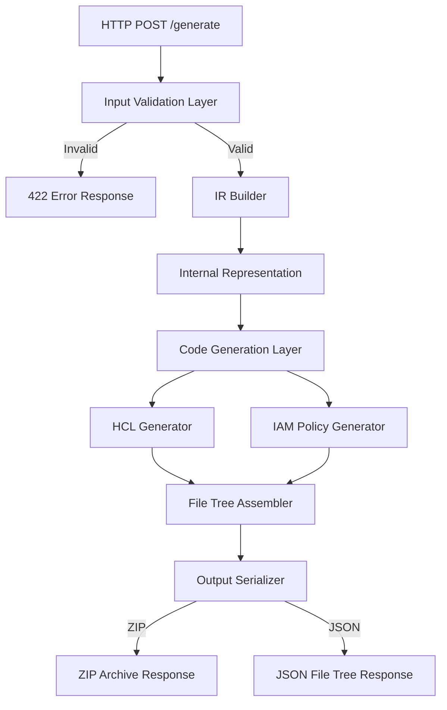
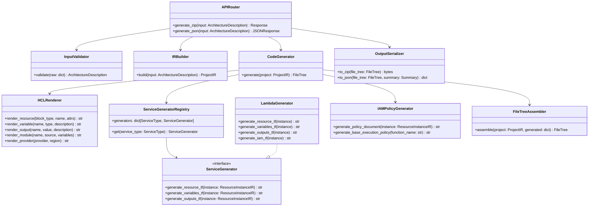

# Design Document: Terraform IaC Generator

## Overview

The Terraform IaC Generator is a Python FastAPI backend that transforms a structured JSON architecture description into a complete, modular Terraform file structure for AWS. The system follows a pipeline architecture: validate input → build internal representation → generate HCL/JSON content → assemble file tree → return as ZIP or JSON.

The generator produces a well-organized folder hierarchy:

```
{project_name}/
├── environments/
│   ├── dev/
│   │   ├── main.tf
│   │   ├── variables.tf
│   │   ├── outputs.tf
│   │   └── terraform.tfvars
│   └── prod/
│       └── ...
├── modules/
│   ├── lambda/
│   │   ├── main.tf
│   │   ├── variables.tf
│   │   ├── outputs.tf
│   │   ├── my-function/
│   │   │   ├── lambda.tf
│   │   │   ├── iam.tf
│   │   │   ├── variables.tf
│   │   │   └── outputs.tf
│   │   └── my-layer/
│   │       └── ...
│   ├── s3/
│   │   ├── main.tf
│   │   ├── variables.tf
│   │   ├── outputs.tf
│   │   └── my-bucket/
│   │       ├── s3.tf
│   │       ├── variables.tf
│   │       └── outputs.tf
│   ├── dynamodb/
│   │   └── ...
│   ├── api-gateway/
│   │   └── ...
│   └── cloudwatch/
│       └── ...
└── iam-policies/
    ├── my-function-policy.json
    └── ...
```

Six AWS service types are supported in the initial scope: Lambda, S3, API Gateway, DynamoDB, IAM, and CloudWatch.

## Architecture

The system uses a layered pipeline architecture with clear separation between input validation, internal representation building, code generation, and output assembly.



### Pipeline Stages

1. **Input Validation**: Pydantic model validation of the Architecture Description JSON against the defined schema. Rejects unsupported service types and missing required fields.

2. **IR Builder**: Transforms the validated input into an Internal Representation (IR) — a normalized Python data model that captures the full Terraform structure (projects, environments, modules, resource instances, connections).

3. **Code Generation**: Service-specific generators produce HCL strings for each file. The IAM Policy Generator produces JSON policy documents. Each generator is a pure function: IR node in → string content out.

4. **File Tree Assembler**: Collects all generated file contents into a `FileTree` dictionary mapping relative file paths to their string contents.

5. **Output Serializer**: Converts the `FileTree` into either a ZIP archive or a JSON response, plus a generation summary.

### Key Design Decisions

- **Pure function generators**: Each HCL/JSON generator is a stateless function that takes an IR node and returns a string. This makes generators independently testable and composable.
- **IR as single source of truth**: All generation flows from the IR, never directly from the input schema. This decouples input format from generation logic.
- **Service generator registry**: A dictionary mapping `ServiceType` enum values to generator functions, making it trivial to add new service types.
- **Pydantic for validation and data models**: Leverages Pydantic v2 for both input validation (with automatic 422 error responses) and internal data models.

## Components and Interfaces

### Component Diagram



### Interface Contracts

**ServiceGenerator Protocol** — Each AWS service type implements this interface:

```python
class ServiceGenerator(Protocol):
    def generate_resource_tf(self, instance: ResourceInstanceIR) -> str: ...
    def generate_variables_tf(self, instance: ResourceInstanceIR) -> str: ...
    def generate_outputs_tf(self, instance: ResourceInstanceIR) -> str: ...
```

Lambda's generator extends this with `generate_iam_tf()`.

**HCLRenderer** — Low-level HCL block rendering. All generators use this to produce syntactically valid HCL:

```python
class HCLRenderer:
    def render_resource(self, block_type: str, name: str, attrs: dict) -> str: ...
    def render_variable(self, name: str, var_type: str, description: str, default: Any = None) -> str: ...
    def render_output(self, name: str, value: str, description: str) -> str: ...
    def render_module(self, name: str, source: str, variables: dict[str, str]) -> str: ...
    def render_provider(self, provider: str, region: str) -> str: ...
```

**IAMPolicyGenerator** — Produces JSON IAM policy documents:

```python
class IAMPolicyGenerator:
    def generate_policy_document(self, instance: ResourceInstanceIR) -> str: ...
    def generate_base_execution_policy(self, function_name: str) -> str: ...
```

**FileTree** — The central output type, a simple dictionary:

```python
FileTree = dict[str, str]  # {relative_path: file_content}
```

### Service Generator Registry

The registry maps `ServiceType` to generator instances. Adding a new AWS service means implementing `ServiceGenerator` and registering it:

```python
GENERATOR_REGISTRY: dict[ServiceType, ServiceGenerator] = {
    ServiceType.LAMBDA: LambdaGenerator(),
    ServiceType.S3: S3Generator(),
    ServiceType.DYNAMODB: DynamoDBGenerator(),
    ServiceType.API_GATEWAY: APIGatewayGenerator(),
    ServiceType.CLOUDWATCH: CloudWatchGenerator(),
    ServiceType.IAM: IAMGenerator(),
}
```

### Connection Handling

Connections between resources are processed after individual resource generation. The `ConnectionProcessor` inspects each connection in the IR and:

1. Adds integration resources (e.g., `aws_apigatewayv2_integration` for API Gateway → Lambda)
2. Adds IAM policy statements to the source Lambda's policy document
3. Uses Terraform references (`aws_lambda_function.name.arn`) instead of hardcoded values

```python
class ConnectionProcessor:
    def process(self, connection: ConnectionIR, project: ProjectIR) -> list[GeneratedFile]: ...
```

## Data Models

### Input Schema: Architecture Description

```python
from pydantic import BaseModel, Field
from enum import Enum
from typing import Optional

class ServiceType(str, Enum):
    LAMBDA = "lambda"
    S3 = "s3"
    API_GATEWAY = "api-gateway"
    DYNAMODB = "dynamodb"
    IAM = "iam"
    CLOUDWATCH = "cloudwatch"

class ResourceConfig(BaseModel):
    """Service-specific configuration for a resource instance."""
    # Lambda
    handler: Optional[str] = None
    runtime: Optional[str] = None
    memory_size: Optional[int] = None
    timeout: Optional[int] = None
    is_layer: bool = False
    # S3
    versioning: Optional[bool] = None
    # DynamoDB
    billing_mode: Optional[str] = None
    hash_key: Optional[str] = None
    hash_key_type: Optional[str] = None
    range_key: Optional[str] = None
    range_key_type: Optional[str] = None
    # API Gateway
    protocol_type: Optional[str] = None
    # CloudWatch
    retention_in_days: Optional[int] = None

class ResourceInstance(BaseModel):
    name: str = Field(..., description="User-defined resource name, used as subfolder name")
    service_type: ServiceType
    config: ResourceConfig = Field(default_factory=ResourceConfig)

class Connection(BaseModel):
    source: str = Field(..., description="Name of the source resource instance")
    target: str = Field(..., description="Name of the target resource instance")
    connection_type: str = Field(..., description="e.g., 'triggers', 'reads_from', 'writes_to'")

class EnvironmentConfig(BaseModel):
    name: str = Field(..., description="Environment name, e.g., dev, staging, prod")
    variables: dict[str, str] = Field(default_factory=dict)

class ArchitectureDescription(BaseModel):
    project_name: str = Field(..., description="Root folder name for the generated project")
    environments: list[EnvironmentConfig] = Field(..., min_length=1)
    resources: list[ResourceInstance] = Field(..., min_length=1)
    connections: list[Connection] = Field(default_factory=list)
```

### Internal Representation (IR)

The IR is a normalized tree structure that the code generators consume. It is built from the validated input and enriched with derived data (e.g., which IAM statements each Lambda needs).

```python
class ResourceInstanceIR(BaseModel):
    name: str
    service_type: ServiceType
    config: ResourceConfig
    iam_statements: list[IAMStatement] = Field(default_factory=list)
    connections: list[ConnectionIR] = Field(default_factory=list)

class IAMStatement(BaseModel):
    effect: str = "Allow"
    actions: list[str]
    resources: list[str]  # Terraform references, e.g., "${aws_dynamodb_table.my_table.arn}"

class ConnectionIR(BaseModel):
    source_name: str
    target_name: str
    source_service: ServiceType
    target_service: ServiceType
    connection_type: str

class ServiceModuleIR(BaseModel):
    service_type: ServiceType
    instances: list[ResourceInstanceIR]

class EnvironmentIR(BaseModel):
    name: str
    variables: dict[str, str]
    module_refs: list[ServiceType]  # Which modules this environment references

class ProjectIR(BaseModel):
    project_name: str
    environments: list[EnvironmentIR]
    modules: list[ServiceModuleIR]
    connections: list[ConnectionIR]

class GeneratedFile(BaseModel):
    path: str  # Relative path from project root
    content: str  # File content (HCL or JSON)

class GenerationSummary(BaseModel):
    project_name: str
    environment_count: int
    module_count: int
    resource_instance_count: int
    iam_policy_count: int
```

### HCL Generation Approach

The `HCLRenderer` produces HCL strings using template-based string construction. Each method builds a single HCL block type:

- **Two-space indentation** throughout all generated files
- **Terraform references** (e.g., `aws_lambda_function.name.arn`) are used for cross-resource wiring instead of hardcoded values
- **`file()` function references** are used in `iam.tf` to point to JSON policy documents in the `iam-policies/` folder

Example output from `render_resource("aws_lambda_function", "my_func", {...})`:

```hcl
resource "aws_lambda_function" "my_func" {
  function_name = var.function_name
  role          = aws_iam_role.my_func_role.arn
  handler       = var.handler
  runtime       = var.runtime
}
```

The renderer does not use a third-party HCL library. HCL is generated via Python string formatting with proper escaping and indentation. This keeps the dependency footprint minimal and gives full control over output formatting.

### JSON IAM Policy Generation

The `IAMPolicyGenerator` produces standalone JSON files following the AWS IAM policy document schema:

```json
{
  "Version": "2012-10-17",
  "Statement": [
    {
      "Effect": "Allow",
      "Action": [
        "dynamodb:GetItem",
        "dynamodb:PutItem",
        "dynamodb:Query"
      ],
      "Resource": "${aws_dynamodb_table.my_table.arn}"
    }
  ]
}
```

Policy generation rules:
- One JSON file per Lambda resource instance: `{resource_name}-policy.json`
- Every Lambda gets a base execution policy with CloudWatch Logs permissions (`logs:CreateLogGroup`, `logs:CreateLogStream`, `logs:PutLogEvents`)
- Connection-derived permissions are consolidated into the single policy file per Lambda
- The Lambda's `iam.tf` references the policy via `file("${path.root}/../../iam-policies/{name}-policy.json")`

### File Structure Generation Logic

The `FileTreeAssembler` walks the `ProjectIR` tree and collects all generated content into a `FileTree`:

1. **Environment files**: For each `EnvironmentIR`, generate `main.tf` (provider + module blocks), `variables.tf`, `outputs.tf`, `terraform.tfvars`
2. **Service module files**: For each `ServiceModuleIR`, generate root-level `main.tf` (module blocks referencing subfolders), `variables.tf`, `outputs.tf`
3. **Resource instance files**: For each `ResourceInstanceIR`, generate `{service_type}.tf`, `variables.tf`, `outputs.tf`, and optionally `iam.tf` (Lambda only)
4. **IAM policy files**: For each Lambda `ResourceInstanceIR`, generate `{name}-policy.json` in `iam-policies/`

### API Endpoint Design

```
POST /generate/zip
  Request Body: ArchitectureDescription (JSON)
  Response: application/zip (ZIP archive of the file tree)
  Errors: 422 (validation), 500 (generation failure)

POST /generate/json
  Request Body: ArchitectureDescription (JSON)
  Response: application/json
  {
    "summary": { "project_name": "...", "environment_count": 2, ... },
    "files": { "my-project/environments/dev/main.tf": "...", ... }
  }
  Errors: 422 (validation), 500 (generation failure)
```

Both endpoints share the same pipeline; only the output serialization differs.


## Correctness Properties

*A property is a characteristic or behavior that should hold true across all valid executions of a system — essentially, a formal statement about what the system should do. Properties serve as the bridge between human-readable specifications and machine-verifiable correctness guarantees.*

### Property 1: Valid input acceptance

*For any* `ArchitectureDescription` containing any subset of the six supported service types (Lambda, S3, API Gateway, DynamoDB, IAM, CloudWatch) with all required fields present, the input validator should accept it without errors.

**Validates: Requirements 1.1, 1.4**

### Property 2: Invalid input error reporting

*For any* `ArchitectureDescription` with one or more required fields removed, the validator should reject it with a 422 response, and the error list should identify every missing or invalid field.

**Validates: Requirements 1.2**

### Property 3: Project-level folder structure

*For any* valid `ArchitectureDescription` with project name P, E environments, and S distinct service types, the generated file tree should contain: a root folder named P, an `environments/` folder with exactly E subfolders, a `modules/` folder with exactly S subfolders, and an `iam-policies/` folder.

**Validates: Requirements 2.1, 2.2, 2.3, 3.1, 3.2, 9.1**

### Property 4: Environment file completeness

*For any* valid `ArchitectureDescription` and *for any* environment defined in it, the generated file tree should contain exactly four files in that environment's subfolder: `main.tf`, `variables.tf`, `outputs.tf`, and `terraform.tfvars`.

**Validates: Requirements 2.4**

### Property 5: Environment variable consistency

*For any* valid `ArchitectureDescription` and *for any* environment, the set of variable names declared in `variables.tf` should exactly match the set of keys present in `terraform.tfvars`, and the values in `terraform.tfvars` should match the environment-specific values from the input.

**Validates: Requirements 2.5, 2.7**

### Property 6: Environment module references

*For any* valid `ArchitectureDescription` and *for any* environment, the environment's `main.tf` should contain a `module` block for each distinct service type in the architecture, and `outputs.tf` should contain output blocks exposing attributes from those modules.

**Validates: Requirements 2.6, 2.8**

### Property 7: Service module file structure and content

*For any* service module in the generated output, the module root should contain `main.tf`, `variables.tf`, and `outputs.tf`. The `main.tf` should contain one `module` block per resource instance in that service. The `outputs.tf` should contain output blocks aggregating outputs from all resource instances.

**Validates: Requirements 3.3, 3.4, 3.5, 3.6**

### Property 8: Resource instance subfolder structure

*For any* resource instance in the generated output, a subfolder named after the user-defined resource name should exist inside its service module folder, containing a main resource file named `{service_type}.tf`, `variables.tf`, and `outputs.tf`.

**Validates: Requirements 4.1, 4.2, 4.3, 4.4**

### Property 9: Lambda iam.tf with file() references

*For any* Lambda resource instance (including Lambda layers), the generated subfolder should contain an `iam.tf` file that includes `file()` function calls referencing the `iam-policies/` folder.

**Validates: Requirements 4.5, 4.6, 9.5**

### Property 10: Service-specific required attributes

*For any* resource instance, the generated resource block should contain all required attributes for its service type: Lambda requires `function_name`, `role`, `handler`, `runtime`; S3 requires `bucket`; DynamoDB requires `name`, `billing_mode`, `hash_key`, and an `attribute` block; API Gateway requires `name`, `protocol_type`; CloudWatch requires `name`.

**Validates: Requirements 5.6, 5.7, 5.8, 5.9, 5.10**

### Property 11: HCL block attribute completeness

*For any* generated `variable` block, it should contain `description` and `type` attributes. *For any* generated `output` block, it should contain `description` and `value` attributes. *For any* generated `module` block, it should contain a `source` attribute with a valid relative path.

**Validates: Requirements 5.3, 5.4, 5.5**

### Property 12: Two-space indentation

*For any* generated `.tf` file, every indented line should use two-space indentation (no tabs, no other indent widths).

**Validates: Requirements 7.4**

### Property 13: IR serialization round-trip

*For any* valid `ArchitectureDescription`, building the IR, serializing it to HCL file contents, and parsing those contents back into an IR should produce an equivalent data structure.

**Validates: Requirements 7.2, 7.3**

### Property 14: Output format correctness

*For any* valid `ArchitectureDescription`, the ZIP endpoint should return a valid ZIP archive containing all files from the file tree, and the JSON endpoint should return a JSON object with `files` and `summary` keys where `summary` counts match the actual generated counts.

**Validates: Requirements 6.2, 6.3, 6.4**

### Property 15: API Gateway–Lambda integration generation

*For any* connection between an API Gateway resource and a Lambda resource in the architecture, the generated output should contain an `aws_apigatewayv2_integration` resource linking the two.

**Validates: Requirements 8.1**

### Property 16: Connection-derived IAM policy statements

*For any* Lambda resource instance with connections to other resources (DynamoDB, S3, CloudWatch), the generated JSON policy document should contain IAM statements with actions scoped to each connected service type and resources referencing the connected resource.

**Validates: Requirements 8.2, 8.3, 8.4, 9.4**

### Property 17: Terraform references over hardcoded values

*For any* connection between resources, the generated integration and IAM code should use Terraform resource references (e.g., `aws_lambda_function.name.arn`) instead of hardcoded ARN strings.

**Validates: Requirements 8.5**

### Property 18: One consolidated IAM policy per Lambda

*For any* Lambda resource instance, exactly one JSON policy file should exist in `iam-policies/` named `{resource_name}-policy.json`, and it should contain all permission statements (including the base CloudWatch Logs execution policy) consolidated into a single document.

**Validates: Requirements 9.2, 9.6, 9.7**

### Property 19: Valid IAM policy JSON syntax

*For any* generated JSON policy document, it should parse as valid JSON and contain the required fields: `Version` (set to `"2012-10-17"`), and a `Statement` array where each statement has `Effect`, `Action`, and `Resource` fields.

**Validates: Requirements 9.3**

### Property 20: AWS provider configuration

*For any* environment `main.tf`, the file should contain a `provider "aws"` block with a configurable `region` attribute.

**Validates: Requirements 5.2**

## Error Handling

### Input Validation Errors (422)

- Pydantic validation errors are automatically converted to 422 responses by FastAPI
- Each validation error includes the field path, error type, and human-readable message
- Unsupported `ServiceType` values are caught by the Pydantic enum validator
- Custom validators enforce business rules (e.g., DynamoDB must have `hash_key` in config)

### Generation Errors (500)

- All generation code runs inside a try/except block at the API handler level
- Internal errors are caught, logged, and returned as 500 responses with a descriptive error message
- The error message identifies the failure point (e.g., "Failed to generate Lambda module for resource 'my-func': ...")
- No partial output is returned on failure

### Connection Validation

- Connections referencing non-existent resource names are caught during IR building and returned as 422 errors
- Connections between incompatible service types (e.g., S3 → S3) are rejected with descriptive errors

## Testing Strategy

### Unit Tests

Unit tests cover specific examples, edge cases, and error conditions:

- **Input validation**: Test specific valid/invalid payloads, boundary cases (empty resources list, missing fields, unsupported service types)
- **HCL rendering**: Test each `HCLRenderer` method with known inputs and expected HCL output strings
- **Service generators**: Test each generator with a specific `ResourceInstanceIR` and verify the output contains expected HCL blocks
- **IAM policy generation**: Test policy JSON output for specific connection scenarios
- **Connection processing**: Test specific connection types (API Gateway→Lambda, Lambda→DynamoDB, etc.)
- **File tree assembly**: Test with a small known input and verify the complete file tree structure
- **Output serialization**: Test ZIP creation and JSON response formatting
- **Error cases**: Test 422 and 500 error responses with specific trigger inputs

### Property-Based Tests

Property-based tests verify universal properties across randomly generated inputs. Use the `hypothesis` library for Python.

Each property test:
- Runs a minimum of 100 iterations
- References its design document property with a comment tag
- Uses `hypothesis` strategies to generate random `ArchitectureDescription` inputs

**Tag format**: `# Feature: terraform-iac-generator, Property {N}: {title}`

**Test organization**:
- `tests/test_properties.py` — All property-based tests
- `tests/test_unit.py` — All unit tests
- `tests/conftest.py` — Shared fixtures and hypothesis strategies

**Hypothesis strategies needed**:
- `architecture_description_strategy()` — Generates random valid `ArchitectureDescription` objects with random subsets of service types, random resource names, random environments, and random connections
- `resource_instance_strategy(service_type)` — Generates a random `ResourceInstanceIR` for a given service type
- `connection_strategy(resources)` — Generates valid connections between existing resources

**Property test mapping**:
- Each correctness property (1–20) maps to exactly one property-based test
- Property 13 (round-trip) is the highest-value test — it validates the entire serialization pipeline

**Configuration**:
```python
from hypothesis import settings

@settings(max_examples=100)
def test_property_N(...):
    ...
```
